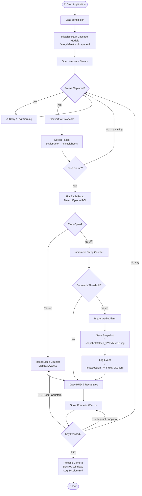

<div align="center">
<pre>
███████╗██╗     ███████╗███████╗██████╗ ██╗███╗   ██╗ ██████╗      █████╗ ██╗      █████╗ ██████╗ ███╗   ███╗
██╔════╝██║     ██╔════╝██╔════╝██╔══██╗██║████╗  ██║██╔════╝     ██╔══██╗██║     ██╔══██╗██╔══██╗████╗ ████║
███████╗██║     █████╗  █████╗  ██████╔╝██║██╔██╗ ██║██║  ███╗    ███████║██║     ███████║██████╔╝██╔████╔██║
╚════██║██║     ██╔══╝  ██╔══╝  ██╔═══╝ ██║██║╚██╗██║██║   ██║    ██╔══██║██║     ██╔══██║██╔══██╗██║╚██╔╝██║
███████║███████╗███████╗███████╗██║     ██║██║ ╚████║╚██████╔╝    ██║  ██║███████╗██║  ██║██║  ██║██║ ╚═╝ ██║
╚══════╝╚══════╝╚══════╝╚══════╝╚═╝     ╚═╝╚═╝  ╚═══╝ ╚═════╝     ╚═╝  ╚═╝╚══════╝╚═╝  ╚═╝╚═╝  ╚═╝╚═╝     ╚═╝

                    ███████╗██╗   ██╗███████╗████████╗███████╗███╗   ███╗
                    ██╔════╝╚██╗ ██╔╝██╔════╝╚══██╔══╝██╔════╝████╗ ████║
                    ███████╗ ╚████╔╝ ███████╗   ██║   █████╗  ██╔████╔██║
                    ╚════██║  ╚██╔╝  ╚════██║   ██║   ██╔══╝  ██║╚██╔╝██║
                    ███████║   ██║   ███████║   ██║   ███████╗██║ ╚═╝ ██║
                    ╚══════╝   ╚═╝   ╚══════╝   ╚═╝   ╚══════╝╚═╝     ╚═╝
</pre>

<!-- Badges Row 1 -->
<p>
  
  
  
  
</p>

<!-- Badges Row 2 -->
<p>
  
  
  
  
  
</p>

<br/>


> 💡 **Stay alert. Stay productive. Stay safe.**
>
> An entirely **offline**, privacy-first drowsiness detection tool that watches your eyes in real time
> and fires an alarm the instant it detects you drifting off — no cloud, no subscriptions, no data leaks.

<br/>

</div>

<br/>

---

## 📋 Table of Contents

<details>
<summary>Click to expand</summary>

- [Demo](#-demo)
- [Overview](#-overview)
- [Features](#-features)
- [How It Works](#-how-it-works)
- [System Workflow](#-system-workflow)
- [Project Structure](#-project-structure)
- [Tech Stack](#-tech-stack)
- [Installation](#-installation)
- [Usage](#-usage)
- [Configuration](#%EF%B8%8F-configuration)
- [Keyboard Controls](#%EF%B8%8F-keyboard-controls)
- [Performance Benchmarks](#-performance-benchmarks)
- [Privacy & Security](#-privacy--security)
- [Roadmap](#-roadmap)
- [Troubleshooting](#-troubleshooting)
- [FAQ](#-faq)
- [Acknowledgements](#-acknowledgements)

</details>

---

## 🎥 Demo

<div align="center">

| 👁️ Eyes Open — Awake | 😴 Eyes Closed — Alert Triggered |
|:---:|:---:|
| `✓ AWAKE` banner · Green eye rectangles | `⚠ SLEEPING DETECTED` · Red banner · Alarm fires |

> 📌 **Live webcam feed with real-time overlay HUD.**
> The system processes every frame locally — no recording, no uploading.

</div>

---

## 🧠 Overview

The **Sleeping Alarm System** is a real-time, on-device drowsiness detection application built with Python and OpenCV. Using classical **Haar Cascade classifiers**, it monitors your face and eyes through your webcam and triggers an audio alert the moment it detects prolonged eye closure — a key indicator of drowsiness.

### 🎯 Who is this for?

| 👤 User | 🧩 Use Case |
|--------|-------------|
| 🚗 **Long-distance drivers** | Alert system during fatigue on the road |
| 💼 **Late-night workers** | Stay productive during late work sessions |
| 🎮 **Gamers** | Avoid falling asleep mid-session |
| 📚 **Students** | Study sessions without dozing off |
| 🔬 **Researchers** | Baseline drowsiness detection experiment |

### 🆕 What's New in v2.0

- ✅ Modular architecture — `alarm.py`, `logger.py`, `config.json`
- ✅ Full CLI with `--camera`, `--threshold`, `--no-snapshots` flags
- ✅ Real-time HUD overlay (FPS · Status banner · Event counter)
- ✅ Structured JSON-Lines session logging
- ✅ Cross-platform alarm engine (`winsound` → `pygame` → terminal bell)
- ✅ Auto-snapshot on drowsiness detection (face images stay local)
- ✅ Keyboard shortcuts for manual snapshot and counter reset

---

## ✨ Features

<div align="center">

| # | Feature | Description | Status |
|---|---------|-------------|--------|
| 1 | 🎥 **Live Webcam Feed** | Streams from default or any selected camera index | ✅ |
| 2 | 👁️ **Face & Eye Detection** | Haar Cascade classifiers — fast, CPU-only, no GPU needed | ✅ |
| 3 | 🔊 **Smart Cross-Platform Alarm** | Windows `winsound` → `pygame` → terminal bell | ✅ |
| 4 | 📊 **Real-Time HUD** | FPS counter · status banner · sleep event counter | ✅ |
| 5 | 📸 **Auto Snapshots** | JPEG saved locally on detection (gitignored, private) | ✅ |
| 6 | 📝 **Session Logging** | JSON-Lines logs per day — parseable and analyzable | ✅ |
| 7 | ⚙️ **Config-Driven** | Zero code changes needed — tune everything in `config.json` | ✅ |
| 8 | 🖥️ **100% Offline** | No network calls, no API keys, no data leaves your machine | ✅ |
| 9 | 🎛️ **CLI Interface** | `--camera`, `--threshold`, `--config`, `--no-snapshots` | ✅ |
| 10 | ⌨️ **Keyboard Controls** | `ESC` quit · `S` snapshot · `R` reset counters | ✅ |

</div>

---

## 🔬 How It Works

The system uses a **3-stage detection pipeline** on every captured frame:

```
Frame (BGR)
    │
    ▼
┌─────────────────────────────┐
│  Stage 1 — Grayscale        │  Convert BGR → Gray for faster processing
│  cv2.cvtColor(BGR2GRAY)     │
└──────────────┬──────────────┘
               │
               ▼
┌─────────────────────────────┐
│  Stage 2 — Face Detection   │  Haar Cascade on full frame
│  face_default.xml           │  Returns (x, y, w, h) bounding boxes
└──────────────┬──────────────┘
               │  For each face ROI:
               ▼
┌─────────────────────────────┐
│  Stage 3 — Eye Detection    │  Haar Cascade on cropped face region
│  eye.xml                    │  Counts detected eyes in the ROI
└──────────────┬──────────────┘
               │
    ┌──────────┴──────────┐
    │                     │
    ▼                     ▼
 eyes ≥ 1            eyes == 0
 AWAKE ✅            SLEEPING 😴
 Reset counter       Increment counter
                     If counter ≥ threshold → 🚨 ALARM
```

### 🧮 Detection Parameters

| Parameter | Default | Effect |
|-----------|---------|--------|
| `scale_factor` | `1.1` | How much to shrink image each pass (lower = more accurate, slower) |
| `min_neighbors_face` | `5` | Higher = fewer false positives for faces |
| `min_neighbors_eye` | `3` | Lower = more sensitive eye detection |
| `sleep_frame_threshold` | `20` | Frames of closed eyes before alarm (~0.7s at 30fps) |

---

## 🔄 System Workflow



---

## 📁 Project Structure

```
SLEEPING-ALARM-SYSTEM/
│
├── 📄 drowsiness_detector.py       ← 🧠 Main entry point & detection loop
├── ⚙️  config.json                  ← User settings (no secrets, safe to commit)
├── 📦 requirements.txt             ← Pinned Python dependencies
│
├── 🗂️  utils/
│   ├── __init__.py
│   ├── 🔊 alarm.py                 ← Cross-platform alarm engine
│   └── 📝 logger.py                ← JSON-Lines session event logger
│
├── 🤖 face_default.xml             ← Haar Cascade — Face detection model
├── 🤖 eye.xml                      ← Haar Cascade — Eye detection model
├── 🤖 smile.xml                    ← Haar Cascade — Smile model (future use)
│
├── 📸 snapshots/                   ← Auto-generated (gitignored ✗)
├── 📋 logs/                        ← Session logs (gitignored ✗)
│
├── 🔒 .github/
│   └── workflows/
│       └── codeql.yml              ← GitHub CodeQL security scanning
│
├── 🚫 .gitignore                   ← Keeps personal data out of repo
├── 🔐 SECURITY.md                  ← Vulnerability & privacy policy
└── 📖 README.md                    ← This file
```

---

## 🛠️ Tech Stack

<div align="center">

| Technology | Version | Role | Why chosen |
|------------|---------|------|------------|
| 🐍 **Python** | 3.8+ | Core language | Broad ecosystem, cross-platform |
| 👁️ **OpenCV** | 4.7.x | Camera I/O, Haar Cascades, drawing | Industry-standard CV library |
| 🔢 **NumPy** | 1.24.x | Frame array ops, waveform generation | Fast vectorized math |
| 🔊 **pygame** | 2.5+ | Audio on Linux/macOS | Cross-platform, no system deps |
| 📦 **winsound** | stdlib | Windows beep | Zero install on Windows |

</div>

---

## 🚀 Installation

### ✅ Prerequisites

- Python **3.8 or higher** → [Download](https://python.org/downloads)
- A working **webcam** (built-in or USB)
- `pip` (comes with Python)

### ⚡ Quick Start

```bash
# 1. Clone the repository
git clone https://github.com/PRATHAM777P/sleeping-alarm-system.git
cd sleeping-alarm-system
```

```bash
# 2. Create & activate a virtual environment (strongly recommended)
python -m venv .venv

# 🪟 Windows
.venv\Scripts\activate

# 🐧 Linux / 🍎 macOS
source .venv/bin/activate
```

```bash
# 3. Install all dependencies
pip install -r requirements.txt
```

```bash
# 4. Run it!
python drowsiness_detector.py
```

> ✅ That's it. The webcam window opens immediately.

---

## ▶️ Usage

### 🎛️ Command-Line Options

```
python drowsiness_detector.py [OPTIONS]

Options:
  --camera INT       Camera index to use (default: from config.json)
  --threshold INT    Frames of closed eyes before alarm (default: from config.json)
  --config PATH      Path to a custom config JSON file
  --no-snapshots     Disable saving face snapshots on detection
  -h, --help         Show this help message and exit
```

### 📌 Examples

```bash
# Default — reads all settings from config.json
python drowsiness_detector.py

# Use second camera (e.g. external USB webcam)
python drowsiness_detector.py --camera 1

# More sensitive — alarm after only 10 frames (~0.33s)
python drowsiness_detector.py --threshold 10

# Run without saving any snapshots
python drowsiness_detector.py --no-snapshots

# Use a custom config profile
python drowsiness_detector.py --config configs/night_mode.json
```

---

## ⚙️ Configuration

> Edit **`config.json`** — no code changes ever needed.

```jsonc
{
  // 📷 Camera
  "camera_index": 0,              // 0 = default webcam, 1 = second cam

  // 😴 Detection sensitivity
  "sleep_frame_threshold": 20,    // consecutive eye-closed frames → alarm

  // 🖥️ Display
  "display_fps": true,            // FPS counter top-right
  "display_status_bar": true,     // status banner at bottom

  // 📸 Snapshots (stored locally, gitignored)
  "save_snapshots": true,
  "snapshot_dir": "snapshots",

  // 📝 Logging (stored locally, gitignored)
  "log_events": true,
  "log_dir": "logs",

  // 🔊 Alarm sound
  "alarm_beep_frequency": 1000,   // Hz — 1000 = 1kHz tone
  "alarm_beep_duration_ms": 1000, // milliseconds

  // 🔬 Haar Cascade tuning
  "scale_factor": 1.1,
  "min_neighbors_face": 5,
  "min_neighbors_eye": 3,

  // 🎨 Rectangle colors [B, G, R]
  "rectangle_color_face": [0, 0, 255],   // Red
  "rectangle_color_eye":  [0, 255, 0]    // Green
}
```

---

## ⌨️ Keyboard Controls

<div align="center">

| Key | Action | When useful |
|:---:|---------|-------------|
| `ESC` | 🚪 Quit the application | End session |
| `S` | 📸 Save a manual snapshot | Capture any moment |
| `R` | 🔄 Reset all counters | Start fresh in same session |

</div>

---

## 📈 Performance Benchmarks

Tested on typical consumer hardware:

| Hardware | Resolution | FPS (approx.) | CPU Usage |
|----------|------------|---------------|-----------|
| Intel Core i5 (8th gen) | 640×480 | ~28–30 fps | ~12% |
| Intel Core i3 (10th gen) | 640×480 | ~25–28 fps | ~18% |
| Raspberry Pi 4 | 320×240 | ~10–15 fps | ~45% |

> 💡 **Tip:** Lower `scale_factor` (e.g. `1.05`) improves accuracy but reduces FPS. Raise it to `1.3` for faster performance on weaker hardware.

---

## 🔒 Privacy & Security

<div align="center">

```
┌─────────────────────────────────────────────────────────────┐
│               🛡️  PRIVACY GUARANTEE                          │
│                                                              │
│  ✅  All processing happens ON YOUR DEVICE                   │
│  ✅  Zero network calls — no internet required               │
│  ✅  No API keys, tokens, or credentials needed             │
│  ✅  Snapshots are local-only and gitignored                 │
│  ✅  Logs contain no personal identifiers                    │
│  ❌  No video is recorded or streamed                        │
│  ❌  No data is sent to any server, ever                     │
└─────────────────────────────────────────────────────────────┘
```

</div>

| Data Type | Where it goes | Persisted? | Committed to Git? |
|-----------|--------------|------------|-------------------|
| Webcam frames | RAM only — processed & discarded | ❌ | ❌ |
| Face/eye ROI regions | RAM only | ❌ | ❌ |
| Sleep-event snapshots | `snapshots/` on your machine | ✅ local | ❌ gitignored |
| Session event logs | `logs/` on your machine | ✅ local | ❌ gitignored |

See [`SECURITY.md`](SECURITY.md) for the full vulnerability reporting policy.

---

## 🗺️ Roadmap

<details>
<summary>View planned features →</summary>

| Version | Feature | Status |
|---------|---------|--------|
| v2.1 | 📊 **Daily stats dashboard** — HTML report of sleep events | 🔜 Planned |
| v2.1 | 🎵 **Custom alarm sound** — use any `.mp3` or `.wav` | 🔜 Planned |
| v2.2 | 🧠 **EAR (Eye Aspect Ratio)** — dlib-based more accurate detection | 🔜 Planned |
| v2.2 | 📱 **System tray icon** — run silently in background | 🔜 Planned |
| v2.3 | 🌙 **Night mode** — adjusted thresholds for low-light conditions | 💭 Idea |
| v3.0 | 🤖 **MediaPipe Face Mesh** — 468-landmark precision detection | 💭 Idea |

</details>

---

## 🛠️ Troubleshooting

<details>
<summary><b>❌ Camera not opening / black screen</b></summary>

```bash
# Try a different camera index
python drowsiness_detector.py --camera 1
python drowsiness_detector.py --camera 2
```

Also check that no other app (Zoom, Teams, OBS) is using your webcam.

</details>

<details>
<summary><b>❌ "Haar cascade XML not found" error</b></summary>

Make sure `face_default.xml` and `eye.xml` are in the **same folder** as `drowsiness_detector.py`. Do not move them.

</details>

<details>
<summary><b>❌ No alarm sound on Linux/macOS</b></summary>

```bash
pip install pygame
# Then retry — pygame provides audio on non-Windows systems
```

</details>

<details>
<summary><b>❌ Too many false positives (glasses, lighting)</b></summary>

Edit `config.json`:
```json
"min_neighbors_eye": 5,     // raise from 3 → reduces false positives
"sleep_frame_threshold": 30  // raise from 20 → needs more frames to trigger
```

</details>

<details>
<summary><b>❌ Low FPS / sluggish performance</b></summary>

Edit `config.json`:
```json
"scale_factor": 1.3,         // raise from 1.1 → faster but less accurate
"min_neighbors_face": 3      // lower → fewer detection passes
```

</details>

---

## ❓ FAQ

<details>
<summary><b>Does it work with glasses?</b></summary>

It depends on the frame thickness and reflection. Thin-frame glasses usually work fine. Thick frames or reflective lenses may require increasing `min_neighbors_eye` to reduce false positives.

</details>

<details>
<summary><b>Does it work in low light?</b></summary>

Haar Cascades work best with decent lighting. In low light, face/eye detection becomes unreliable. A desk lamp pointed away from the camera (indirect lighting) helps significantly.

</details>

<details>
<summary><b>Can I use it with a virtual camera (OBS, ManyCam)?</b></summary>

Yes — set `"camera_index"` to the index of your virtual camera. Use `--camera 1`, `--camera 2`, etc. to find it.

</details>

<details>
<summary><b>Is any data sent to Anthropic or any cloud?</b></summary>

**Absolutely not.** This project has zero network code. It never imports `requests`, `urllib`, `socket`, or any networking library.

</details>

---


## 🙏 Acknowledgements

| Resource | Credit |
|---------|--------|
| [OpenCV](https://opencv.org/) | Core computer vision library & Haar Cascade models |
| [Haar Cascades](https://github.com/opencv/opencv/tree/master/data/haarcascades) | Pre-trained XML classifiers |
| [pygame](https://www.pygame.org/) | Cross-platform audio engine |
| [Python](https://python.org/) | The language that makes it all possible |

---


<div align="center">

<!-- Footer wave -->


**Made with 👁️ and Python**

⭐ **Star this repo** if it helped you stay awake! ⭐

[](https://github.com/YOUR_USERNAME/sleeping-alarm-system)
[](https://github.com/YOUR_USERNAME/sleeping-alarm-system/fork)

*100% Offline · Zero Cloud · Your Data Stays Yours*

</div>
